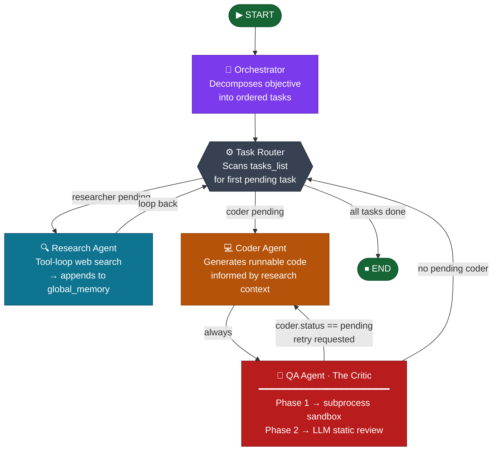

<div align="center">

# 🤖 Multi-Agent AI Workflow System

**An autonomous, self-correcting multi-agent pipeline built on LangGraph and Claude**

[](https://python.org)
[](https://langchain-ai.github.io/langgraph/)
[](https://anthropic.com)
[](https://streamlit.io)
[](https://supabase.com)
[](https://docs.pydantic.dev)
[](LICENSE)

<br/>

> A production-ready agentic system where an Orchestrator decomposes any high-level goal into tasks, dispatches specialist agents to execute them, and automatically corrects code errors through a sandboxed QA feedback loop — all visualised in real time via a Streamlit dashboard.

</div>

---

## Table of Contents

- [Architecture Overview](#architecture-overview)
- [Self-Correction Loop](#self-correction-loop)
- [Technology Stack](#technology-stack)
- [Project Structure](#project-structure)
- [Installation](#installation)
- [Configuration](#configuration)
- [Running the Application](#running-the-application)
- [Supabase Schema](#supabase-schema)

---

## Architecture Overview

The system is built as a **stateful directed graph** using LangGraph's `StateGraph`. A single shared `AgentState` object flows through every node, accumulating tasks and memory as agents execute. Routing decisions are made purely from task status — no hidden flags or side-channels.

### Workflow Graph



### Shared State — `AgentState`

All agents read from and write to a single `TypedDict`. LangGraph merges updates through typed **reducer functions** rather than full state replacement:

| Field | Type | Reducer | Purpose |
|---|---|---|---|
| `user_objective` | `str` | last-write-wins | The top-level goal set at workflow start |
| `tasks_list` | `list[Task]` | merge-by-id | Plan created by Orchestrator; updated in-place as agents run |
| `global_memory` | `list[str]` | append (`operator.add`) | Accumulates research insights, code notes, and QA verdicts |
| `current_agent` | `str` | last-write-wins | Tracks which node last wrote to state |

Each `Task` is a **Pydantic model** with `id`, `description`, `assigned_agent`, `status` (`pending → completed | failed`), and `output`.

### Routing Logic

The **Task Router** is a pure function — it scans `tasks_list` in order and returns the node name for the first `pending` task whose `assigned_agent` is routable:

```
researcher → "research"
coder      → "coder"
(none)     → END
```

`reviewer` tasks are intentionally excluded from the router. QA is always reached via the **unconditional** `coder → qa` edge, making the review step mandatory for every piece of generated code.

---

## Self-Correction Loop

The QA Agent is a **two-phase critic** that closes the loop between code generation and verification. It is the core reliability mechanism of the system.

```
┌──────────────────────────────────────────────────────────────┐
│                    QA Agent — The Critic                     │
│                                                              │
│  ┌─────────────────────────────────────────────────────┐    │
│  │  Phase 1: Sandbox Execution                         │    │
│  │                                                     │    │
│  │  Generated code is written to a temp file and       │    │
│  │  executed in a subprocess using the venv's own      │    │
│  │  interpreter. Stdout, stderr, and exit code are     │    │
│  │  captured. Execution is killed after 15 seconds.    │    │
│  └──────────────┬──────────────────────────────────────┘    │
│                 │                                            │
│           fails │ passes                                     │
│                 ↓                                            │
│  ┌─────────────────────────────────────────────────────┐    │
│  │  Phase 2: LLM Static Review (only if phase 1 passes)│    │
│  │                                                     │    │
│  │  Claude reviews correctness, completeness, code     │    │
│  │  quality, security, and robustness using a strict   │    │
│  │  structured-output schema (_QAOutput).              │    │
│  └─────────────────────────────────────────────────────┘    │
└──────────────────────────────────────────────────────────────┘
```

### Retry Signal Protocol

The QA Agent communicates retry intent through **task status** rather than memory strings, keeping the router decoupled from QA internals:

| QA Outcome | `coder.status` set to | `reviewer.status` set to | Router response |
|---|---|---|---|
| Execution error — retry allowed | `"pending"` | `"failed"` | Route back to Coder |
| LLM review failed — retry allowed | `"pending"` | `"failed"` | Route back to Coder |
| Execution error — max retries hit | `"failed"` | `"failed"` | Fall through to END |
| LLM review passed | unchanged (`"completed"`) | `"completed"` | Advance to next task |

### Error Feedback to Coder

When a retry is triggered, the **exact** subprocess error log — traceback, line number, exception type — is written to `global_memory` with a `[QA — <id>] FAILED` prefix. On the next invocation the Coder Agent reads all such entries and includes them verbatim under a `PREVIOUS ATTEMPTS FAILED — fix every issue listed below` header. No summarisation, no paraphrasing — the model sees the raw Python error.

### Retry Limit

A maximum of **3 attempts** is enforced by counting `[QA — <task_id>] FAILED` prefixes in `global_memory` before writing a new entry. On the third failure, `coder.status` is set to `"failed"` (not `"pending"`), which causes the Task Router to advance to END rather than looping again.

---

## Technology Stack

| Layer | Technology | Role |
|---|---|---|
| **Orchestration** | [LangGraph](https://langchain-ai.github.io/langgraph/) 1.2.2 | Stateful agent graph, routing, streaming |
| **LLM** | [Claude 3.7 Sonnet](https://anthropic.com) via `langchain-anthropic` 1.4.4 | All agent reasoning and structured output |
| **State schema** | [Pydantic](https://docs.pydantic.dev) v2 + `TypedDict` | `Task` model, structured LLM outputs, reducers |
| **Web UI** | [Streamlit](https://streamlit.io) 1.58.0 | Real-time live dashboard with placeholder updates |
| **Persistence** | [Supabase](https://supabase.com) 2.30.1 | Postgres + JSONB storage for completed workflow runs |
| **Terminal UI** | [Rich](https://rich.readthedocs.io) 14.3.4 | Syntax highlighting, panels, spinners in `main.py` |
| **Search** | Mock tool (default) / [Tavily](https://tavily.com) (optional) | Research agent web search |
| **Env config** | [python-dotenv](https://github.com/theskumar/python-dotenv) 1.2.2 | `.env` loading for API keys |
| **Sandbox** | `subprocess` + `tempfile` (stdlib) | Isolated code execution in QA phase 1 |

---

## Project Structure

```
.
├── app.py                      # Streamlit visual interface (primary entry point)
├── main.py                     # Rich terminal interface (alternative entry point)
├── .env                        # API keys (not committed)
├── requirements.txt            # Pinned dependency manifest
│
└── src/
    ├── agents/
    │   ├── orchestrator.py     # Orchestrator node — task decomposition via structured output
    │   └── specialists.py      # Research, Coder, and QA agent nodes + sandbox executor
    │
    ├── graphs/
    │   └── agent_graph.py      # AgentState schema, routers, StateGraph assembly, run_workflow()
    │
    └── memory/
        └── database.py         # Supabase client — save_run() and fetch_runs()
```

---

## Installation

### Prerequisites

- Python **3.11+** (project uses 3.14)
- An [Anthropic API key](https://console.anthropic.com/)
- A [Supabase](https://supabase.com/) project (optional — only needed for persistence)
- A [Tavily API key](https://tavily.com/) (optional — the research agent falls back to a mock tool)

### 1. Clone the repository

```bash
git clone https://github.com/your-username/multi-agent-workflow.git
cd multi-agent-workflow
```

### 2. Create and activate a virtual environment

```bash
# Windows
python -m venv .venv
.venv\Scripts\activate

# macOS / Linux
python3 -m venv .venv
source .venv/bin/activate
```

### 3. Install dependencies

```bash
pip install -r requirements.txt
```

---

## Configuration

Copy the template below into your `.env` file at the project root:

```env
# ── Required ──────────────────────────────────────────────
ANTHROPIC_API_KEY=sk-ant-...

# ── Optional: Supabase persistence ────────────────────────
SUPABASE_URL=https://your-project.supabase.co
SUPABASE_KEY=your-anon-or-service-role-key

# ── Optional: real web search (falls back to mock) ────────
TAVILY_API_KEY=tvly-...
```

> **Note:** The workflow runs fully without Supabase or Tavily credentials. Missing keys are detected at runtime and handled gracefully — the app will display a warning instead of crashing.

---

## Running the Application

### Streamlit Dashboard *(recommended)*

```bash
streamlit run app.py
```

Opens at `http://localhost:8501`. Features:
- Live task pipeline table with status icons (⏳ ⚙️ ✅ ❌) that update as agents run
- Real-time sidebar showing accumulated `global_memory` entries
- Metrics strip (total / done / running / pending / failed)
- Execution log with timestamps and retry indicators (`🔄×N`)
- Automatic Supabase save on workflow completion

### Rich Terminal Interface

```bash
python main.py
```

Features syntax-highlighted code output, coloured agent panels, spinner between steps, and a per-agent timing strip.

### Programmatic API

```python
from src.graphs.agent_graph import run_workflow

final_state = run_workflow("Build a REST API client for the GitHub API")

for task in final_state["tasks_list"]:
    print(task.assigned_agent, task.status, task.output[:120])
```

For streaming:

```python
from src.graphs.agent_graph import get_workflow

for chunk in get_workflow().stream(
    {"user_objective": "...", "tasks_list": [], "global_memory": [], "current_agent": ""},
    stream_mode="updates",
):
    for node_name, update in chunk.items():
        print(f"[{node_name}]", update.get("current_agent"))
```

---

## Supabase Schema

Run this once in your Supabase **SQL Editor** to create the persistence table:

```sql
create table agent_runs (
  id          uuid        primary key default gen_random_uuid(),
  objective   text        not null,
  tasks       jsonb       not null,
  memory      jsonb       not null,
  task_count  int         not null,
  created_at  timestamptz not null default now()
);

-- Optional: index for fast recency queries
create index agent_runs_created_at_idx on agent_runs (created_at desc);
```

Each completed workflow inserts one row. `tasks` is a JSONB array of serialised `Task` objects; `memory` is a JSONB array of strings. Query recent runs:

```sql
select id, objective, task_count, created_at
from agent_runs
order by created_at desc
limit 20;
```

---

<div align="center">

Built with [LangGraph](https://langchain-ai.github.io/langgraph/) · [Anthropic Claude](https://anthropic.com) · [Supabase](https://supabase.com) · [Streamlit](https://streamlit.io)

</div>
